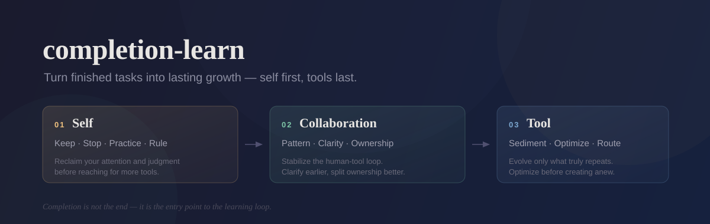

<p align="center">
  
</p>

<p align="center">
  <a href="docs/three-axis-evolution.md"><strong>读主文档</strong></a> · <a href="SKILL.md">SKILL</a> · <a href="references">References</a> · <a href="commands/learn-complete.md">Command Wrapper</a> · <a href="docs/three-axis-evolution.en.md">English Doc</a> · <a href="README.en.md">English</a>
</p>

---

`completion-learn` 是一个 completion-only 的复盘 skill。

它不负责“把任务做完”，而负责在任务做完之后，把这次任务真正转成可复用的成长收益。默认模式不是泛泛总结，也不是情绪性复盘，而是一个固定顺序的三轴演化：

1. 先看人自己怎么变强
2. 再看人和工具怎么协作得更好
3. 最后看工具栈本身怎么进化

这个顺序是刻意设计的。很多 task retrospective 一上来就讨论 prompt、脚本、自动化和 skill，但真正决定上限的，往往先是注意力、判断、节奏和 ownership。`completion-learn` 的默认立场是：先帮人把自己的注意力和判断抢回来，再谈协作，再谈工具。

> 对外更好传播的叫法：`三轴成长复盘`
>
> 一句话介绍：把已完成任务转成成长收益的复盘 skill，默认顺序是 `先自我，再协作，最后工具`。

## 如何介绍这个仓库

如果你想把这个仓库发给别人，最省力的说法是：

> 这是一个 completion-only 的学习 skill。任务做完以后，它不会先帮你堆工具，而是先帮你自己变强，再优化你和工具的协作方式，最后才决定哪些东西值得沉淀成 skill 或继续优化。

## 它解决什么问题

- 任务已经做完，但“经验”还停留在聊天记录里，没有变成下次可用的规则。
- 复盘总是滑向工具堆叠，最后用户知道了更多配置，却没有更强的自我判断。
- 想知道某段流程该不该沉淀成 skill，但又不想每次都直接开始写 skill。
- 想把“skill 沉淀”和“skill 自进化/优化”放进同一条 completion 学习链路里，而不是分裂成两个互不相干的动作。

## 默认三轴顺序

| 轴 | 默认问题 | 输出重点 |
|------|------|------|
| Self | 这次任务之后，用户自己应该保留什么、停止什么、练什么？ | `Keep / Stop / Practice next / Durable rule` |
| Collaboration | 下次人和工具的默认协作模式应该怎样？ | 默认模式、澄清前移、ownership split |
| Tool | 工具栈里什么该进化？ | `skill sedimentation` + `existing skill optimize` |

如果输出必须变短，`completion-learn` 会优先保住 `Self -> Collaboration -> Tool` 这个顺序，而不是平均切分注意力。

## 关键设计

### 1. 只在完成后触发

这个 skill 不应该在中途被自动触发。它要求任务已经足够完成，至少能对结果、失误、判断和 verifier 讲真话。

### 2. 默认是“帮我变强”，不是“帮我总结”

最有价值的输出不是更好看的 recap，而是：

- 一个下次还能用的判断规则
- 一个该停止的坏模式
- 一个该开始练的动作
- 一个该稳定下来的协作模式

### 3. Tool 轴同时覆盖两件事

很多 completion debrief 只会问“要不要做成 skill”。这里不够。`completion-learn` 在 tool 轴里必须同时问两件事：

- 这轮流程值不值得沉淀成 skill？
- 如果相关 skill 已经存在，它是不是只是需要优化、补 references、修 trigger、改 workflow，而不是另起炉灶？

### 4. 先诊断，再路由

`completion-learn` 不直接假设“应该新建 skill”。它先做诊断，再根据结果路由：

- 现有边界正确，但 skill 太弱：优先去 `skill-optimizer`
- 边界要扩，或者应该有第二个互补 skill：去 `skill-creator`
- 证据还不够：停在 recommendation，不强行改文件

这也是为什么它适合作为一个总入口，而不是把“创建 skill”和“优化 skill”混在一个 prompt 里直接硬做。

## 仓库内容

| 路径 | 说明 |
|------|------|
| [`SKILL.md`](SKILL.md) | 主 skill 定义 |
| [`references/`](references) | 三轴复盘的资源包 |
| [`commands/learn-complete.md`](commands/learn-complete.md) | Claude Code slash command wrapper 示例 |
| [`docs/three-axis-evolution.md`](docs/three-axis-evolution.md) | 设计理念与使用边界 |
| [`docs/figs/hero-banner.svg`](docs/figs/hero-banner.svg) | 仓库首页横幅 |

## 快速安装

### Codex

把本仓库放到：

```bash
~/.codex/skills/completion-learn
```

### Claude Code

把同名目录同步到：

```bash
~/.claude/skills/completion-learn
```

如果你想要直接使用 `/learn-complete`，可以额外把：

```bash
commands/learn-complete.md
```

放到 Claude Code 的命令目录。

## 使用方式

默认使用：

```text
/learn-complete
```

含义不是“再总结一下”，而是：

> 任务已经结束。现在请优先帮我自己变强，然后帮我把协作方式和工具方式一起进化。

也支持显式 focus：

```text
/learn-complete debugging
/learn-complete workflow
/learn-complete collaboration
```

如果你只想要建议、不想立刻改技能文件，也可以这样约束：

```text
/learn-complete 只做复盘和 skill 沉淀建议，不要改任何 skill 文件。
```

如果你更喜欢对外使用中文名称，也可以把它叫作：

```text
三轴成长复盘
```

内部 skill id 仍然保持：

```text
completion-learn
```

这样既保留本地生态兼容性，也更利于公开传播。

## 这个 skill 适合什么人

- 不满足于“把事情做完”，而想把每轮 task 变成下一轮优势的人
- 已经在用 Codex / Claude Code / 其他 agent，但发现自己越来越依赖工具、越来越少观察自己的人
- 想要一种更稳定的 learn loop：先长自己，再长协作，再长工具
- 想把 skill 沉淀和 skill 自进化统一到一套 completion workflow 里的人

## 与 `ai-collab-playbook` 的关系

这个仓库是从 [`ai-collab-playbook`](https://github.com/cnfjlhj/ai-collab-playbook) 中拆出的独立 skill 仓。

如果你想看更大的方法论背景，先读：

- 主仓：<https://github.com/cnfjlhj/ai-collab-playbook>
- 设计文档：[`docs/three-axis-evolution.md`](docs/three-axis-evolution.md)

## License

本仓库当前以 [`MIT`](LICENSE) 发布。
